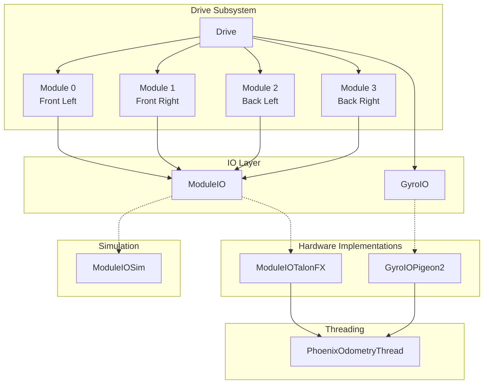
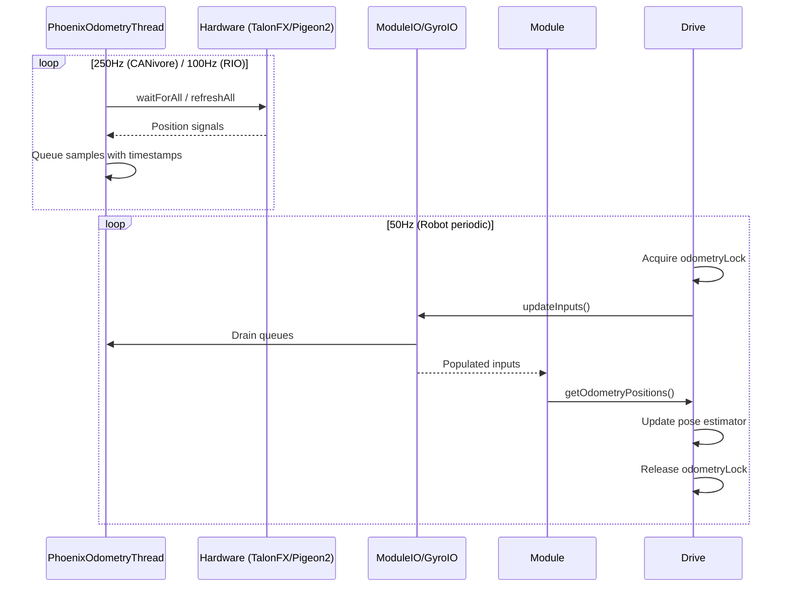

# Drive Subsystem

Swerve drive implementation using the AdvantageKit IO layer pattern. This architecture separates hardware interaction from control logic, enabling deterministic replay and physics simulation. These files should not need to be manually modified.

## Architecture Overview

## Components

### Drive.java

Main subsystem class. Coordinates four swerve modules and a gyro to provide:

- Velocity-based driving via `runVelocity(ChassisSpeeds)`
- Pose estimation using `SwerveDrivePoseEstimator` with vision measurement fusion
- PathPlanner integration for autonomous path following
- SysId routines for drive characterization
- Defensive X-lock stance via `stopWithX()`

### Module.java

Wrapper around a `ModuleIO` implementation. Handles:

- Periodic input logging via AdvantageKit
- Odometry position calculation from high-frequency samples
- Setpoint optimization (cosine scaling, direction optimization)
- Hardware disconnect alerting

### ModuleIO.java

Interface defining swerve module hardware operations:

- Drive/turn motor open-loop and closed-loop control
- Sensor input collection (position, velocity, current, voltage)
- High-frequency odometry data (timestamps, positions)

### ModuleIOTalonFX.java

Hardware implementation using CTRE TalonFX motors and CANcoder. Features:

- Configurable voltage or torque-current (FOC) control modes
- Fused/Remote/Sync CANcoder feedback options
- Motion Magic for turn positioning
- Current limiting at slip threshold

### ModuleIOSim.java

Physics simulation using WPILib `DCMotorSim`. Provides:

- Voltage-based motor simulation with configurable gains
- Simulated PID control for velocity and position
- 50Hz odometry sampling (sufficient for simulation)

### GyroIO.java

Interface for gyroscope hardware:

- Yaw position and velocity
- High-frequency odometry samples for pose estimation

### GyroIOPigeon2.java

CTRE Pigeon2 IMU implementation. Registers yaw signal with the odometry thread for synchronized sampling.

### PhoenixOdometryThread.java

Background thread for high-frequency odometry sampling (250Hz on CANivore, 100Hz on RIO CAN). Features:

- Synchronized sampling using Phoenix `waitForAll` on CAN FD
- Latency-compensated timestamps
- Thread-safe signal registration via queues

## Data Flow

## Key Constants

| Constant             | Source       | Description                            |
| -------------------- | ------------ | -------------------------------------- |
| `ODOMETRY_FREQUENCY` | `Drive.java` | 250Hz (CAN FD) or 100Hz (standard CAN) |
| `DRIVE_BASE_RADIUS`  | `Drive.java` | Calculated from module positions       |
| `PP_CONFIG`          | `Drive.java` | PathPlanner robot configuration        |

Module-specific constants (gear ratios, offsets, PID gains) are sourced from `TunerConstants`.
