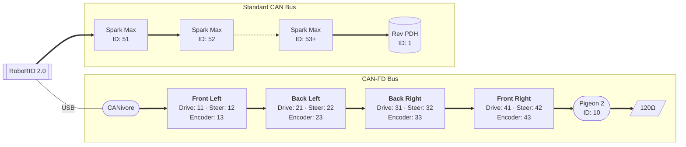

# Wiring Diagram and CAN ID Assignments

## CAN Bus Topology

## CAN ID Summary

### CAN-FD Bus (via CANivore)

| Device                   | CAN ID |
| ------------------------ | ------ |
| Pigeon 2 IMU             | 10     |
| FL Drive Motor (TalonFX) | 11     |
| FL Steer Motor (TalonFX) | 12     |
| FL CANcoder              | 13     |
| BL Drive Motor (TalonFX) | 21     |
| BL Steer Motor (TalonFX) | 22     |
| BL CANcoder              | 23     |
| BR Drive Motor (TalonFX) | 31     |
| BR Steer Motor (TalonFX) | 32     |
| BR CANcoder              | 33     |
| FR Drive Motor (TalonFX) | 41     |
| FR Steer Motor (TalonFX) | 42     |
| FR CANcoder              | 43     |

### Standard CAN Bus (via RoboRIO)

| Device      | CAN ID |
| ----------- | ------ |
| Spark Max 1 | 51     |
| Spark Max 2 | 52     |
| Spark Max N | 53+    |
| Rev PDH     | 1      |

## ID Schema

- **Swerve modules**: `<module number><device type>`
  - Module numbers: 1 (FL), 2 (BL), 3 (BR), 4 (FR)
  - Device types: 1 (drive), 2 (steer), 3 (encoder)
- **Spark Max controllers**: Starting at 51, incrementing
- **Pigeon 2 IMU**: 10
- **Rev PDH**: 1
